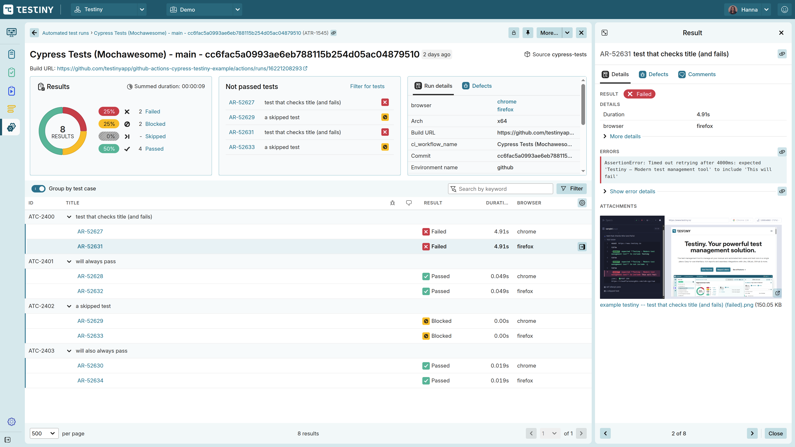

# github-actions-cypress-testiny-example

This repository contains the following examples on how run test automation jobs with GitHub Actions and report results to Testiny:

* Report Cypress Mochawesome JSON reports (.github/workflows/cypress-mochawesome.yml)
* Report Cypress JUnit XML reports (.github/workflows/cypress-junit.yml)

The sample tests are executed on two browsers (Chrome & Firefox) and then reported to Testiny.

The mochawesome report automatically supports skipped tests and attachments, therefore we recommend using this reporter. The JUnit report does neither include skipped tests in its reports nor directly references the screenshots for failed tests.

The Testiny CLI supports mochawesome JSON reports with `--cypress` option and can import the Cypress results into Testiny:



The screenshot shows a run imported from this repository. 

The CLI searches the default attachment directory `cypress/screenshots` and imports screenshots for failed tests found in this folder. If you have another screenshot folder configured, specify another relative base directory path with `--attachment-path <FILE-PATH>`.

When the CLI is executed in a CI/CD pipline, such as GitHub Actions, the CLI also automatically imports fields such as the pipeline build URL, the workflow name, etc. If you want to set additional fields use `--field-values` option.

### Run tests locally

```sh
npm install
npx cypress run --browser chrome
npx cypress run --browser firefox
```
